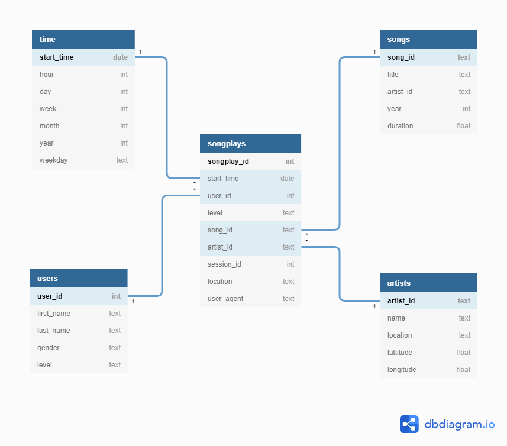

# Sparkify Postgres ETL

## Table of Contents

- [Introduction](#introduction)
- [Context](#context)
- [Schema](#schema)
- [Structure](#structure)
- [Usage](#usage)
- [Run](#run)
- [Result](#result)
- [Warning](#warning)

## Introduction

This project is the first project in [Udacity Data Engineering Nanodegree Program](https://www.udacity.com/course/data-engineer-nanodegree--nd027) course.

The aims of this project are:

- Practice doing data modeling with "Star Schema".

- Learn how to build a simple ETL pipeline using Python.

## Context

A startup company providing music streaming, named Sparkify, want to analyst their collected user data to make better business decisions.

The application data are available and stored in the format of JSON ( in data folder ).

They need a database which is designed to optimize queries for their analysis ( 🠊 the goal of this project ).

## Schema

## Structure

## Usage

## Run

## Result

## Warning
